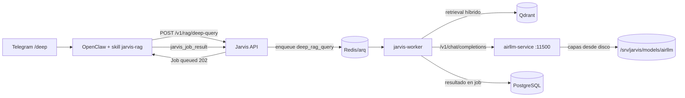

# AirLLM — modo profundo (/deep)

AirLLM ejecuta modelos que no caben en la VRAM cargando el modelo capa a capa desde disco. El precio es la latencia: cada token generado relee todas las capas, así que el disco es el cuello de botella (lo advierte la propia documentación del proyecto). En Jarvis es el segundo backend de inferencia, **nunca** el principal:

* Ollama: consultas normales (`/ask`), clasificación, RAG habitual.
* AirLLM: solo `/deep`, tareas profundas sin urgencia, vía cola de trabajos.

## Arquitectura



* `services/airllm/`: servicio FastAPI independiente con su propio entorno `uv` (versión fijada `airllm==2.11.0`, `torch==2.6.0+cu124` — la última rama de torch con soporte Pascal/GTX 1070). Escucha solo en `127.0.0.1:11500`.
* `packages/inference/airllm.py`: `AirLLMProvider` implementa la interfaz `InferenceProvider` contra la API OpenAI-compatible del servicio; el dominio nunca importa el SDK de AirLLM.
* La consulta profunda **no** pasa por la petición HTTP de la API: `POST /v1/rag/deep-query` devuelve un trabajo (HTTP 202) y el worker la ejecuta en segundo plano, de modo que Telegram y la API nunca se bloquean. El resultado se recoge con `GET /v1/jobs/{id}` (herramienta `jarvis_job_result`).

## Servicio airllm-service

| Endpoint | Uso |
|---|---|
| `GET /health` | estado (`no_model`, `checking`, `loading`, `ready`, `error`), dispositivo, disco, métricas de la última generación |
| `GET /v1/models` | modelo configurado |
| `POST /v1/chat/completions` | generación (OpenAI-compatible, sin streaming) |

Protecciones integradas:

* Comprueba el espacio libre **antes** de descargar: estima el tamaño real del modelo vía metadatos de Hugging Face y exige `tamaño × 2.2 + AIRLLM_MIN_FREE_GB` libres (original + shards por capas + margen).
* Rechaza descargas mayores que `AIRLLM_MAX_MODEL_DOWNLOAD_GB` (12 GiB por defecto): sin disco secundario no se bajan modelos de cientos de GiB.
* Concurrencia de generación 1 (lock) + cola corta (`AIRLLM_QUEUE_MAX_PENDING=2`); si está llena responde 503 con `Retry-After`.
* Timeout de generación configurable (`AIRLLM_GENERATION_TIMEOUT_SECONDS`, 1800 s por defecto).
* Carga del modelo en segundo plano: el servicio responde `/health` desde el primer segundo y systemd lo reinicia si cae (`Restart=on-failure`); tras un reinicio del servidor vuelve a cargar el modelo solo.
* Métricas por generación: duración, tokens de prompt y salida, tokens/s y RSS, en `/health` y en logs JSON (`/srv/jarvis/logs/airllm.log`).

Limitación conocida: una generación ya lanzada no puede abortarse (el bucle de capas de AirLLM no expone cancelación); la cancelación de trabajos (`/cancel`) surte efecto mientras el trabajo espera en cola, y el timeout corta la espera del cliente.

## Configuración (`/srv/jarvis/app/.env`)

| Variable | Significado |
|---|---|
| `AIRLLM_ENABLED` | habilita el modo profundo en API y worker |
| `AIRLLM_MODEL` | repo de Hugging Face a servir por capas |
| `AIRLLM_MODELS_DIR` | almacén de shards (`/srv/jarvis/models/airllm`) |
| `AIRLLM_DEVICE` | `cpu` en este equipo: la GTX 1070 la ocupa Ollama y el prefill de contextos RAG largos agota la VRAM (incidente documentado en `docs/BENCHMARKS.md`); el cuello de botella de AirLLM es el disco, no el cómputo |
| `AIRLLM_COMPRESSION` | vacío, `4bit` u `8bit` (requiere bitsandbytes compatible; no soportado en Pascal — ver benchmark) |
| `AIRLLM_MAX_SEQ_LEN` | contexto máximo del modelo cargado |
| `AIRLLM_MIN_FREE_GB` / `AIRLLM_MAX_MODEL_DOWNLOAD_GB` | frenos de disco |
| `AIRLLM_TIMEOUT_SECONDS` | timeout del cliente (API/worker) hacia el servicio |

## Instalación

```bash
scripts/deploy            # sincroniza el código a /srv/jarvis/app
scripts/install-airllm    # venv aislado + unidad systemd airllm.service
curl -s http://127.0.0.1:11500/health | jq   # esperar status=ready
```

## Selección de modelo

Procedimiento obligatorio antes de cambiar `AIRLLM_MODEL`:

1. Calcular el espacio: tamaño del repo HF × 2.2 + 15 GiB de margen.
2. Comprobar `jarvis_disk` / `df -h /srv/jarvis`.
3. Estimar el tiempo de preparación (descarga + partición por capas: minutos a horas).
4. Probar primero con un modelo pequeño y medir con `scripts/benchmark-airllm`.
5. Documentar el resultado en `docs/benchmarks/`.

Estado actual del hardware (SSD raíz de 114 GiB, sin disco secundario): validado con `NousResearch/Meta-Llama-3.1-8B-Instruct` en fp16 (16 GiB, no cabe en los 8 GiB de VRAM: caso de uso legítimo de AirLLM). Requisitos de compatibilidad aprendidos por la vía dura: el checkpoint debe ser safetensors **multi-shard** con `model.safetensors.index.json` y **sin tied embeddings** (TinyLlama-1.1B falla por lo primero; Llama-3.2 1B/3B por lo segundo). Los modelos realmente "profundos" (70B) exigen ~140 GiB solo de shards: **quedan bloqueados hasta montar un disco dedicado en `/srv/jarvis/models`**, tal como prevé el diseño. Los resultados medidos y las conclusiones honestas de latencia están en `docs/benchmarks/` y resumidos en `docs/BENCHMARKS.md`: AirLLM en este equipo **no** es interactivo (~0.07 tok/s) y solo tiene sentido detrás de la cola.
