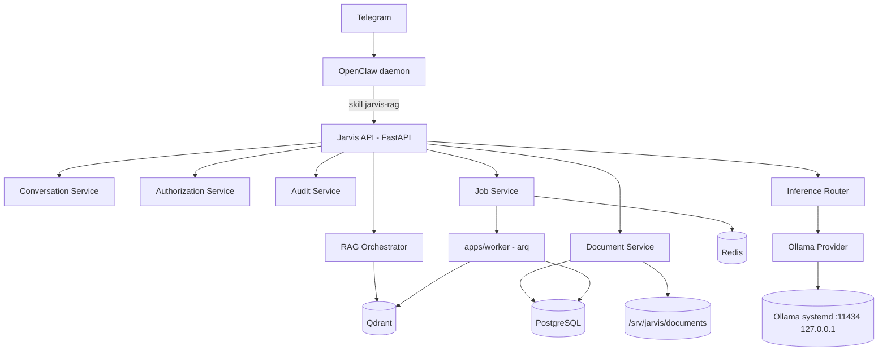
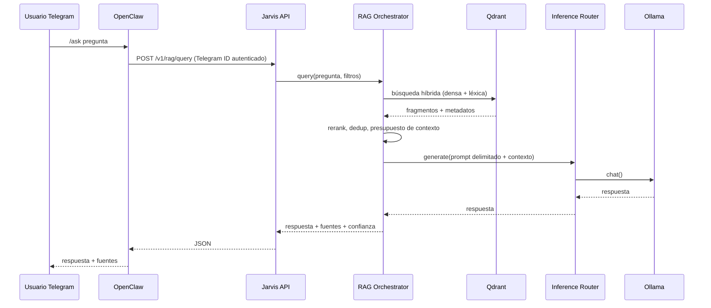

# Arquitectura — Jarvis Local

## Contexto real del hardware (auditoría 2026-07-12)

> Servidor original del proyecto. Desde el 15-09-2026 Jarvis corre en una VM de GCP con
> NVIDIA L4 (23 GB) y Docker Compose: modelos en `docs/MODELS.md`, despliegue en
> `docs/DOCKER.md`.

| Componente | Detalle |
|---|---|
| CPU | Intel Core i7-6700K (4c/8t) |
| RAM | 32 GB |
| GPU | NVIDIA GTX 1070, 8 GB VRAM (driver `nvidia-driver-580`, no instalado al iniciar el proyecto) |
| SO | Ubuntu 26.04 LTS, systemd, sin virtualización (bare metal) |
| Disco raíz | LVM sobre SSD de 120 GB, ~97 GB libres tras el sistema base |
| Disco `sdb` (931 GB) | **Disco dinámico de Windows (LDM)** con volúmenes NTFS "Juegos" y "Familia". Sin espacio libre gestionable desde Linux sin riesgo de corromper la base de datos LDM. **No se toca.** |
| Disco `sdc` (223 GB) | Disco Windows "Basic" (EFI + reservada MS + NTFS + recuperación), ocupado al 99.7%. **No se toca.** |

### Decisión de almacenamiento

El prompt original asumía un disco adicional dedicado a `/srv/jarvis/models`. Al no existir espacio libre seguro en `sdb`/`sdc`, se aplica la regla de repliegue prevista en el propio encargo:

> "Si no existe almacenamiento suficiente, detén únicamente la descarga de modelos grandes, pero continúa construyendo y validando toda la plataforma con un modelo pequeño."

Por tanto:

* `/srv/jarvis/*` se crea sobre el SSD raíz (partición LVM), con los ~97 GB disponibles.
* Solo se descargan modelos pequeños (objetivo: modelos Ollama cuantizados que quepan en la VRAM disponible, no modelos de cientos de GB).
* Si en el futuro se añade un disco dedicado, `/srv/jarvis/models` se migra sin tocar `sdb` ni `sdc`.
* Esta limitación se documenta también en `docs/BENCHMARKS.md`.

### Usuario de sistema dedicado

El prompt original pide crear un usuario `jarvis` dedicado a los servicios. La cuenta de acceso humana en este servidor ya se llama `jarvis` (uid 1000, grupo `sudo`). Para no colisionar, el usuario de sistema sin privilegios que ejecuta los servicios se llama **`jarvis-svc`** (sin shell de login, sin sudo, propietario de `/srv/jarvis`).

## Diagrama de componentes



## Flujo de una consulta `/ask`



## Estructura del repositorio

Ver README.md. Se respeta la estructura pedida en el prompt (`apps/`, `packages/`, `services/`, `integrations/`, `infra/`, `scripts/`, `tests/`, `docs/`).

## Principio de separación de dominios

* `packages/core`: settings, logging estructurado, IDs de correlación, excepciones base.
* `packages/security`: autorización, auditoría, validación de entrada, allowlist de herramientas, protección prompt injection.
* `packages/documents`: parsers, hashing, deduplicación, chunking.
* `packages/rag`: embeddings, almacén vectorial, recuperación híbrida, construcción de citas.
* `packages/inference`: abstracción `InferenceProvider`, `OllamaProvider`, router.
* `apps/api`: FastAPI, únicamente orquesta los paquetes anteriores. No contiene lógica de infraestructura de Ollama más allá de llamadas HTTP a través de `packages/inference`.
* `apps/worker`: cola `arq` sobre Redis para ingestión y tareas largas.
* `integrations/openclaw`: configuración y skill de OpenClaw, sin lógica de dominio.

## Proveedores de inferencia

```text
InferenceProvider (Protocol)
├── generate(prompt, **kwargs) -> InferenceResult
├── chat(messages, **kwargs) -> InferenceResult
├── health() -> ProviderHealth
├── list_models() -> list[ModelInfo]
├── count_tokens(text) -> int
└── capabilities() -> ProviderCapabilities
```

Ningún otro paquete importa `ollama` ni habla HTTP con el motor de inferencia directamente; todo pasa por `packages/inference`.

## Seguridad de red

Todos los servicios (Ollama, Qdrant, PostgreSQL, Redis, OpenClaw gateway, Jarvis API) se vinculan a `127.0.0.1` o a la red interna de Docker (`jarvis_internal`, sin `ports:` publicados salvo los estrictamente necesarios, y solo a loopback). UFW deniega entrada por defecto salvo SSH.
