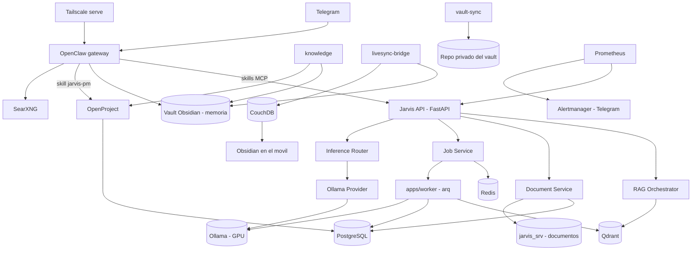
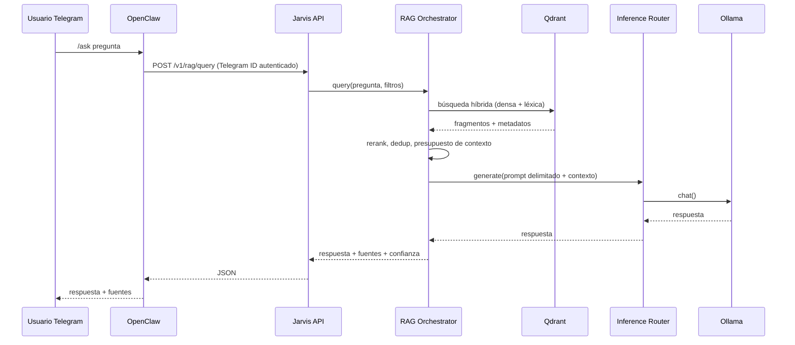

# Arquitectura — Jarvis Local

## Despliegue actual (23-09-2026)

| Componente | Detalle |
|---|---|
| Servidor | VM `jarvis-gpu-us` en GCP, 8 vCPU (Intel Xeon @ 2.20 GHz), 31 GB de RAM, Ubuntu |
| GPU | NVIDIA L4, 23 GB de VRAM |
| Ejecución | Docker Compose (`compose.yml`), un solo `docker compose up -d` (`docs/DOCKER.md`); `compose.cpu.yml` para máquinas sin GPU |
| Modelos | `gemma4:26b-a4b-it-qat` para el chat y `embeddinggemma` para embeddings, elegidos por VRAM detectada (`scripts/select-models`, `docs/MODELS.md`) |
| Almacenamiento | Volúmenes de Docker; los modelos y los documentos viven en el volumen `jarvis_srv` (`/srv/jarvis` dentro de los contenedores) |
| Acceso remoto | Solo por Tailscale: panel de OpenClaw, OpenProject y CouchDB con `tailscale serve` (`docs/ACCESO-REMOTO.md`) |

Los servicios opcionales se activan con perfiles de compose (`COMPOSE_PROFILES`):
`pm` (OpenProject), `vault` y `livesync` (Obsidian), `tailscale`, `monitoring`
(Prometheus, Grafana, exportadores y alertas), `backup`, `assistant` (SearXNG como
servicio aparte), `automation` (n8n) y `webui`.

> **Servidor original.** El proyecto nació en julio de 2026 sobre una máquina bare metal
> (Intel i7-6700K, 32 GB de RAM, GTX 1070 de 8 GB, Ubuntu con systemd) cuyos dos discos
> secundarios eran de Windows y no se podían tocar, de ahí la regla de "modelos pequeños
> sobre el SSD raíz" que marcó las primeras decisiones de `docs/BENCHMARKS.md`. Allí los
> servicios corrían como un usuario de sistema `jarvis-svc` dueño de `/srv/jarvis`. Ese
> camino sigue documentado en `docs/INSTALL.md` y `docs/OPENCLAW-HISTORICO.md`, pero el
> despliegue real es el de Docker Compose desde el 15-09-2026.

## Diagrama de componentes



Los servicios de la mitad inferior son opcionales y llegan por perfiles: OpenProject
(`pm`), el vault y su sincronización (`vault`, `livesync`), SearXNG como servicio aparte
(`assistant`) y la monitorización (`monitoring`).

## Flujo de una consulta `/ask`



## Estructura del repositorio

Ver README.md: `apps/`, `packages/`, `integrations/`, `infra/`, `scripts/`, `tests/` y
`docs/`.

## Principio de separación de dominios

* `packages/core`: settings, logging estructurado, IDs de correlación, excepciones base.
* `packages/security`: autorización, auditoría, validación de entrada, allowlist de herramientas, protección prompt injection.
* `packages/documents`: parsers, hashing, deduplicación, chunking.
* `packages/rag`: embeddings, almacén vectorial, recuperación híbrida, construcción de citas.
* `packages/inference`: abstracción `InferenceProvider`, `OllamaProvider`, router.
* `packages/meetings` y `packages/docgen`: transcripción y actas de reunión, y generación de documentos fundamentados en el RAG.
* `packages/office`: Excel, Word, PowerPoint y OpenDocument a medida.
* `packages/openproject` y `packages/knowledge`: gestión de proyectos y red de conocimiento del vault.
* `packages/imapsmtp`, `packages/caldavcal`, `packages/msgraph`: correo y calendario con backends intercambiables.
* `apps/api`: FastAPI, únicamente orquesta los paquetes anteriores. No contiene lógica de infraestructura de Ollama más allá de llamadas HTTP a través de `packages/inference`.
* `apps/worker`: cola `arq` sobre Redis para ingestión y tareas largas.
* `integrations/openclaw`: configuración y skills MCP de OpenClaw, sin lógica de dominio.

## Proveedores de inferencia

```text
InferenceProvider (Protocol)
├── generate(prompt, **kwargs) -> InferenceResult
├── chat(messages, **kwargs) -> InferenceResult
├── health() -> ProviderHealth
├── list_models() -> list[ModelInfo]
├── count_tokens(text) -> int
└── capabilities() -> ProviderCapabilities
```

Ningún otro paquete importa `ollama` ni habla HTTP con el motor de inferencia directamente; todo pasa por `packages/inference`.

## Seguridad de red

Todos los servicios (Ollama, Qdrant, PostgreSQL, Redis, OpenClaw gateway, Jarvis API) se
vinculan a `127.0.0.1` o a la red interna de Docker, sin `ports:` publicados fuera de
loopback. Lo único accesible desde fuera de la máquina es SSH y lo que se publica en el
tailnet con `tailscale serve`. El estado comprobado del host está en `docs/SECURITY.md`
y el criterio 3 de `docs/ACCEPTANCE.md`.
